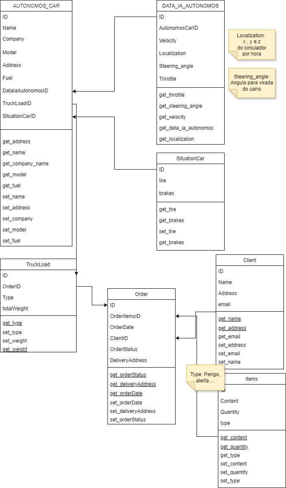

# TCC - Estudo orientado e simulador para controle de tráfego de veículos de transporte autônomos

## RFs (Requisitos funcionais)
Exemplos:
- [ ] Deve ser possivel visualizar o caminhão;
- [ ] Deve ser possivel visualizar quais caminhões estão em operação;
- [ ] Deve ser possivel visualizar trajeto do caminhão;
- [ ] Deve ser possivel verificar o tempo de viajem/faltante;
- [ ] Deve ser possível que o caminhão mande a localização em tempo real;
- [ ] Deve ser possível que caminhão saiba o posto de combustivel mais proximo;
- [ ] Deve ser possível que caminhão valide que chegou ao destino ou saiu da transportadora;
- [ ] Deve ser possível Saber o peso da carga do caminhão.
- [ ] Deve ser possivel Saber qual a carga do caminhão.
- [ ] O caminhão deve conter passe-livre-pedagio
- [ ] Os sensores sensiveis, como o de freio devem sempre estar enviando sinais.
- [ ] Deve manter distancia segura com os carros a frente - ( Calcular em relação a distancia e frenagem )
- [ ] Deve ser possivel calcular ultrapassagem - ( Calcular em relação a distancia e frenagem )

## RNs (Regras de negócio)
Exemplos:
- [ ] O Caminhão não pode sair antes de todos os sensores e permisão serem validados;
- [ ] O Caminhão deve estar com a carga 100% correta para sair;
- [ ] O Caminhão deve ter uma taxa segura de combustivel para conseguir chegar ao proximo posto 100%;
- [ ] O caminhão deve sair exatamente no horario planejado.
- [ ] Sensores de freio devem enviar feedbacks de segurança.
- [ ] O Caminhão deve estár com a manutenção em dia para operar.
- [ ] 

## RNFs (Requisitos não-funcionais)

Exemplos: 
- [x] Os dados devem ser enviadaos para a software web;
- [x] O caminhão deve estar seguindo normas de segurança, IA;

# Model class for this project

# Model relational data 

